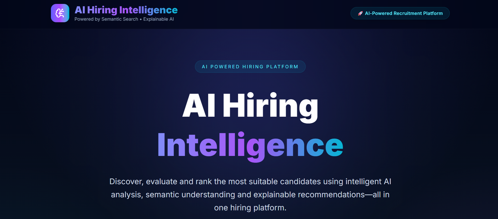
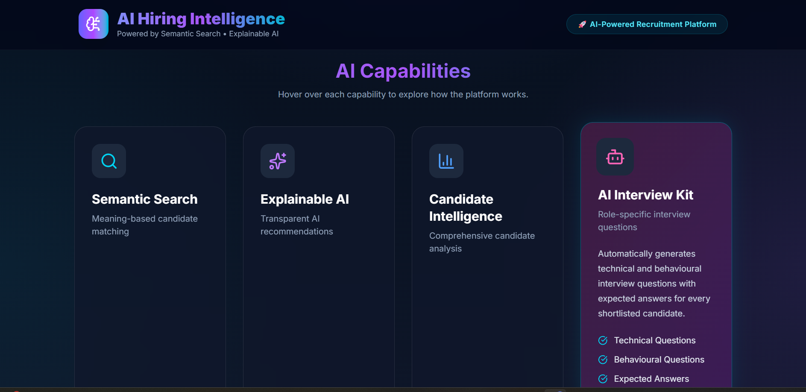
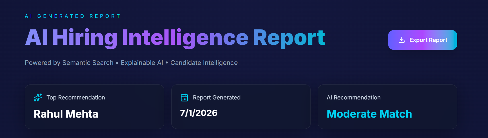
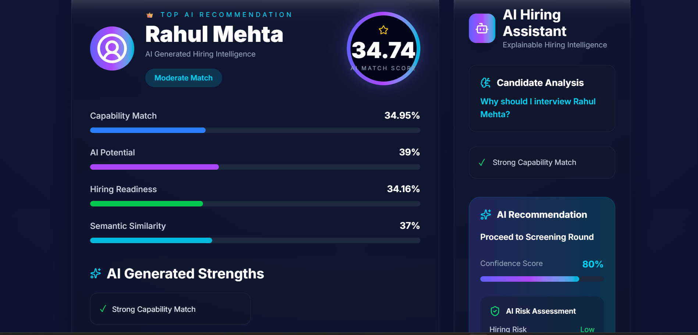
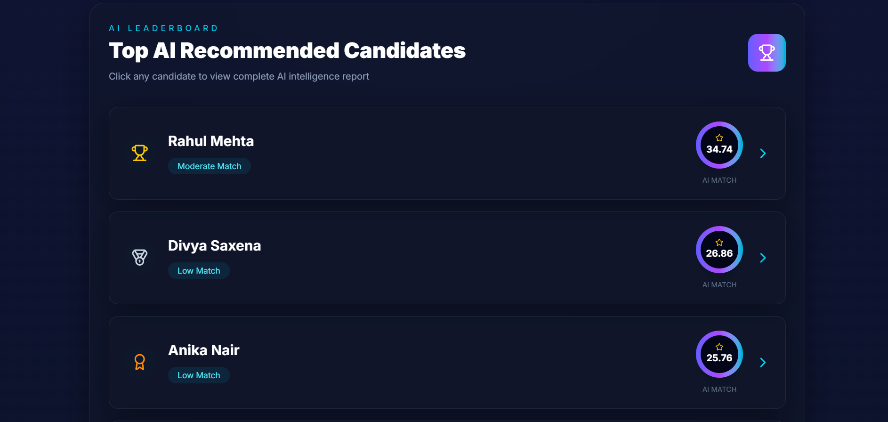
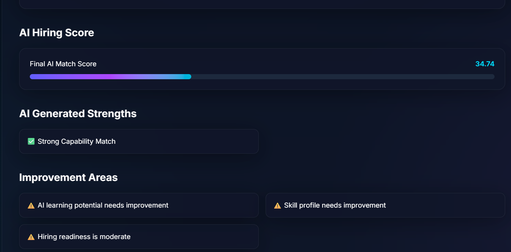
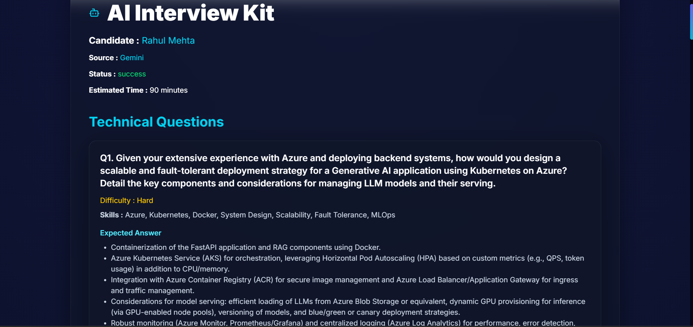

# 🤖 TalentMind AI


## AI-Powered Recruitment Intelligence Platform

> **Developed by Team Semantic Seekers**

TalentMind AI is an Explainable AI-powered Recruitment Intelligence Platform that transforms traditional hiring into an intelligent, transparent, and data-driven recruitment process. By combining semantic search, explainable AI, and generative AI, the platform helps recruiters efficiently identify, evaluate, rank, and interview the most suitable candidates based on job requirements.

---

# 📌 Problem Statement

Recruiters often spend significant time manually reviewing resumes and comparing candidates against job descriptions. Traditional recruitment processes can be slow, subjective, and inconsistent, making it difficult to identify the most suitable candidates efficiently.

TalentMind AI addresses these challenges by automating candidate evaluation through semantic matching, AI-powered ranking, explainable recommendations, and intelligent interview question generation.

---

# ✨ Key Features

## 📄 Job Description Management

- Paste Job Description
- Upload Job Description (PDF, DOCX, TXT)
- Automatic Document Parsing

---

## 🔍 AI Candidate Ranking

- Semantic Candidate Matching
- Capability Matching Engine
- AI Potential Analysis
- Hiring Readiness Assessment
- Skill Credibility Evaluation
- Explainable AI Recommendations

---

## 👤 Candidate Intelligence

- Candidate Profile Summary
- Professional Experience
- Technical Skills Analysis
- AI Match Score
- AI Generated Strengths
- Improvement Areas
- Hiring Recommendation

---

## 🤖 AI Interview Kit

- Technical Interview Questions
- Resume-Based Questions
- Scenario-Based Questions
- Behavioral Questions
- Advanced Technical Questions
- Google Gemini Integration
- TalentMind AI Local Fallback (Quota Safe)

---

## 📊 Recruitment Analytics

- Top Candidate Rankings
- AI Match Score Visualization
- Candidate Intelligence Dashboard
- Hiring Insights

---

## 📥 Reporting

- Export Candidate Intelligence Report as PDF

---

# 🚀 Technology Stack

## Frontend

- React.js
- Vite
- Tailwind CSS
- Axios
- Lucide React

---

## Backend

- Python
- FastAPI
- Pydantic

---

## Artificial Intelligence

- Google Gemini API
- Sentence Transformers
- Semantic Search
- Explainable AI
- Prompt Engineering

---

## Data Storage

- ChromaDB (Vector Database)
- JSON Dataset

---

## Document Processing

- PyPDF2
- python-docx

---

# 🏗 System Architecture

TalentMind AI follows a modular AI recruitment pipeline consisting of job description parsing, semantic candidate matching, intelligent ranking, explainable AI, and interview generation.

📄 **Detailed Architecture Documentation**

See:

```
docs/architecture.md
```

---

# 🔄 End-to-End Workflow

```text
Recruiter

      │

      ▼

Upload / Paste Job Description

      │

      ▼

Job Description Parser

      │

      ▼

Semantic Matching Engine

      │

      ▼

Capability Matching Engine

      │

      ▼

AI Candidate Ranking Engine

      │

      ▼

Explainability Engine

      │

      ▼

Candidate Intelligence Dashboard

      │

      ▼

Candidate Details

      │

      ▼

AI Interview Kit
```

---

# 📂 Project Structure

```text
TalentMind-AI/

├── backend/
│   ├── intelligence/
│   ├── llm/
│   ├── api.py
│   ├── ranking_engine.py
│   ├── explanation_engine.py
│   ├── capability_matcher.py
│   ├── semantic_matcher.py
│   ├── semantic_retriever.py
│   ├── candidate_intelligence.py
│   ├── vector_store.py
│   └── jd_parser.py
│
├── frontend/
│   ├── src/
│   │   ├── assets/
│   │   ├── components/
│   │   ├── pages/
│   │   ├── services/
│   │   └── utils/
│
├── config/
│
├── data/
│
├── docs/
│   └── architecture.md
```

---
## 📁 Dataset

The complete development dataset (~10,000 candidate profiles, ~465 MB) is excluded from this repository due to GitHub size limitations.

To run the project locally, provide a compatible JSONL candidate dataset inside the `data/` directory.


# 🖥 Application Screenshots

## 🖥 Application Screenshots

### 1. Home Page




### 2. AI Capabilities 



### 3. Job Description Input


### 4. AI Hiring Report




### 5. Candidate Analysis Dashboard




### 6. Top Recommended Candidates




### 7. Candidate Intelligence Overview


### 8. Candidate Intelligence Analysis




### 9. Technical Skills Assessment


### 10. AI Interview Kit button 


### 11. AI Interview Kit




# ⚙ Installation Guide

## Clone Repository

```bash
git clone https://github.com/<your-username>/TalentMind-AI.git

cd TalentMind-AI
```

---

## Backend Setup

```bash
pip install -r requirements.txt

python -m uvicorn backend.api:app --reload
```

Backend runs on:

```
http://127.0.0.1:8000
```

---

## Frontend Setup

```bash
cd frontend

npm install

npm run dev
```

Frontend runs on:

```
http://localhost:5173
```

---

# 📈 Future Enhancements

- 🤖 AI Recruiter Assistant
- 📄 Resume Parsing & Candidate Profile Creation
- 🔄 ATS Integration (Workday, Greenhouse, Lever)
- 📅 Interview Scheduling
- 📊 Candidate Comparison Dashboard
- 📈 Advanced Hiring Analytics
- ☁ Cloud Deployment
- 📧 Email Notifications

---

# 👥 Team

### Project

**TalentMind AI**

### Team

**Semantic Seekers**

---

# 📜 License

This project was developed for educational, research, and demonstration purposes.

---

# 🙏 Acknowledgements

This project was built using the following open-source technologies:

- Google Gemini
- FastAPI
- React.js
- Tailwind CSS
- ChromaDB
- Sentence Transformers
- PyPDF2
- python-docx